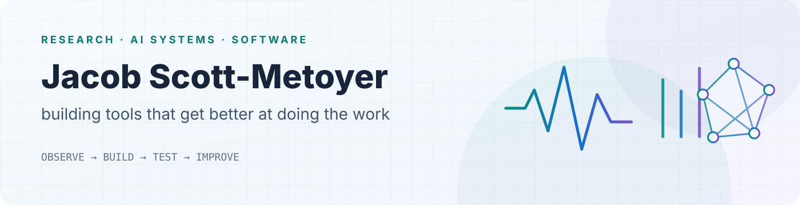

<picture>
  <source media="(prefers-color-scheme: dark)" srcset="./assets/profile-banner-dark.svg">
  <source media="(prefers-color-scheme: light)" srcset="./assets/profile-banner-light.svg">
  
</picture>

## I'm Jacob Metoyer. I research, build, write, and make things.

Biology and medicine are lasting commitments for me, alongside computation and AI. I'm studying at CSULB and hope to pursue an **MD/PhD**. My research experience spans behavior and neurobiology, protein modeling, rehabilitation, and tools for studying human movement.

I also follow interests that don't fit neatly into a research title. I create the **Spire of Octaves** world and related fiction as **M. Schauz**, build software, work on cosplay and physical props, and spend a lot of time with anime, manga, and games. Those aren't separate people or a collection of job keywords. They're different parts of the same ongoing body of work.

### Fiction & worlds ? M. Schauz

**M. Schauz is my creative byline.** Spire of Octaves is a writing-first world project: long-form fiction, shorts, lore, visual development, and experiments toward interactive work. Its stories include *Seamwork*, *Veria*, and *A Cold Reminder*, alongside the main Spire narrative. Drafts, published work, and future ambitions are not interchangeable.

[Seamwork on Royal Road](https://www.royalroad.com/fiction/183255/seamwork)

### Selected public software

| Project | What it is |
|---|---|
| [CaptureSuite](https://github.com/Jacob-Met/CaptureSuite) | Windows-first research capture software: worker plugins, sealed sessions, and downstream analysis workflows. |
| [CanvasPilot](https://github.com/Jacob-Met/canvaspilot) | Canvas LMS tools through a Python CLI and MCP interface. Use only with authorized access and appropriate approval for write actions. |
| [uma-sim](https://github.com/Jacob-Met/uma-sim) | An unofficial Rust-based Umamusume career simulator with a browser interface and developer-facing tools. |

These are public project entry points, not a claim that every feature is production-qualified. Research data, collaborators' unpublished work, and private source remain private.

### Making & interests

Cosplay, CAD, 3D printing, fictional worlds, anime, manga, and games belong here too?not just in an "outside work" footnote.

[Cosplay ? @tornadocos](https://www.instagram.com/tornadocos/) ? [MyAnimeList ? TornadoZW](https://myanimelist.net/profile/TornadoZW)

### How I use AI

I use AI deliberately in research, writing, design, and software development. I don't claim to have hand-written every line or hand-made every asset. Direction, selection, revision, checking, and responsibility for what I release are still mine; collaborators and source material deserve their own credit.

I don't think a tool label is a verdict on quality. Read the fiction, inspect or run the software, and examine the methods behind research. The work should earn its claims on those terms.

[LinkedIn](https://www.linkedin.com/in/jacob-scott-metoyer-15b701352)
